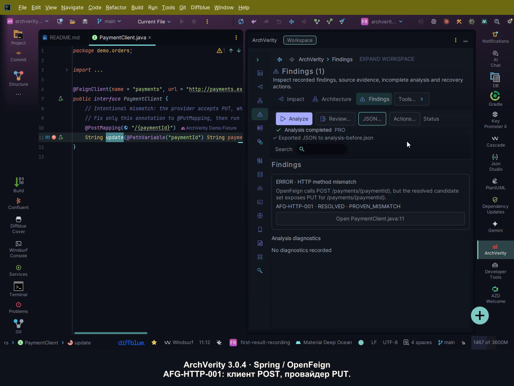

# Как найти расхождение Spring HTTP контракта в ArchVerity 3.0.4

Два Spring-сервиса могут успешно компилироваться и при этом по-разному понимать
один HTTP-вызов. В этом примере OpenFeign-клиент отправляет `POST`, а контроллер
принимает `PUT` по тому же пути. Разберём, как ArchVerity связывает обе стороны,
показывает расхождение в IDEA и позволяет проверить исправление повторным анализом.

Это практическое продолжение статьи
[Why Spring Contracts Break Between Repositories While Everything Still Compiles](https://archverity.hashnode.dev/why-spring-contracts-break-between-repositories-while-everything-still-compiles).
Здесь используется небольшой открытый проект `first-result`. Все имена, код и
данные синтетические. Сервер, база данных, Docker и доступ к чужим репозиториям
для этого примера не нужны.

## Демонстрация за 70 секунд

[](media/first-result-3.0.4.mp4)

[Смотреть или скачать MP4](media/first-result-3.0.4.mp4) — запись реальной IDEA
2026.1.4 с установленной ArchVerity 3.0.4, русскими пояснениями и без озвучки.
Паузы между шагами вырезаны. В ролике видны finding, код контроллера, исправление
клиента, повторный Analyze и возврат расхождения после восстановления `POST`.

Проверенные экспорты дают **1 → 0 → 1 finding** при одинаковом scope: каждый
анализ завершён (`COMPLETE`, `partial=false`), обе стороны присутствуют, неизвестных
связей нет. Оба Java-модуля компилируются до и после исправления; в конце исходный
файл восстановлен. [Данные проверки ролика](media/first-result-3.0.4.proof.json)
фиксируют версии, результат и SHA-256 видео. Этот пример проверяет один HTTP-сценарий;
границы полного функционального аудита приведены ниже.

## Почему компилятор пропускает расхождение

В модуле `order-app` интерфейс клиента объявляет вызов так:

```java
@FeignClient(name = "payments", url = "http://payments.example.test", path = "/payments")
public interface PaymentClient {
    @PostMapping("/{paymentId}")
    String update(@PathVariable("paymentId") String paymentId);
}
```

В модуле `payment-app` контроллер ожидает другой HTTP-метод:

```java
@RestController
@RequestMapping("/payments")
public class PaymentController {
    @PutMapping("/{paymentId}")
    public String update(@PathVariable("paymentId") String paymentId) {
        return "updated:" + paymentId;
    }
}
```

Импорты опущены; полные файлы находятся в
[проекте first-result](../projects/first-result/README.md). Оба объявления корректны
для Java. Компилятор проверяет типы и вызовы внутри каждого модуля, а согласование
`POST /payments/{paymentId}` с `PUT /payments/{paymentId}` требует сравнить
контракт между клиентом и провайдером.

ArchVerity строит эту связь по исходникам и конфигурации. Корневой файл
[.archflow.yml](../projects/first-result/.archflow.yml) явно относит `order-app`
к `order-service`, а `payment-app` — к `payment-service`. Алиас
`payments.example.test` связывает указанный URL клиента с провайдером. Это
зарезервированный домен для примера; анализ не отправляет на него HTTP-запрос.

## Подготовка отдельной копии

Установите [ArchVerity из JetBrains Marketplace](https://plugins.jetbrains.com/plugin/34234-archverity).
На 5 октября 2026 года последняя совместимая стандартная версия — **3.0.4**:
она поддерживает IDEA builds `253.33813.55`–`262.*`. Для IDEA 2024.3 существует
отдельная **3.0.4-2024.3**, builds `243.21565.193`–`243.*`. Сверьте свою сборку
на [странице версий](https://plugins.jetbrains.com/plugin/34234-archverity/versions).
Для платных операций нужен действующий Trial или подписка; демо не выдаёт лицензию.

Для подготовки нужны Git, Python 3.10+ и JDK 21. Первый импорт Gradle и библиотек
требует сети. Выполните команды в папке, где храните проекты:

```powershell
git clone https://github.com/lMysticl/ArchVerity-Demo.git
cd ArchVerity-Demo
python -B -X utf8 suite-support/check_suite.py
python -B -X utf8 suite-support/prepare_project.py --project first-result --output ../archverity-first-demo
```

Если репозиторий уже клонирован, начните в его корне с двух последних команд.
На системах с именем интерпретатора `python3` используйте его вместо `python`.
Папка назначения должна быть новой: помощник создаёт отдельный чистый Git-проект
и отказывается перезаписывать существующую папку. Исходный пример в репозитории
остаётся пригодным для повторения.

Откройте **созданную папку `archverity-first-demo` как Gradle-проект**, выберите
JDK 21 как Gradle JVM и дождитесь импорта обоих модулей и индексации. Из терминала
созданного проекта выполните:

```powershell
.\gradlew.bat classes
```

В Linux и macOS команда — `./gradlew classes`. Сборка должна завершиться успешно
уже при исходном расхождении. Этот проект предназначен для анализа исходников
и не содержит запускаемого Spring Boot приложения.

## Finding и обе стороны вызова

Откройте **View → Tool Windows → ArchVerity**, запустите **Analyze** для всего
проекта и перейдите в **Findings**. Выберите **HTTP method mismatch**
(`AFG-HTTP-001`). Проверьте метод и путь на обеих сторонах. В карточке нажмите
**Open PaymentClient.java**, чтобы перейти к клиенту. Контроллер откройте через
**Navigate → File** (`Ctrl+Shift+N` в Windows/Linux, `⌘⇧O` в macOS), введя
`PaymentController.java`. Сравните эти файлы:

- `order-app/src/main/java/demo/orders/PaymentClient.java` — `@PostMapping`;
- `payment-app/src/main/java/demo/payments/PaymentController.java` — `@PutMapping`.

Само наличие красного finding ещё не объясняет причину. Связь с исходниками
позволяет проверить, какие объявления сравнивались и почему они относятся к
одному сервисному вызову. В этом примере обе стороны разрешены, поэтому
различие методов можно проверить непосредственно в коде.

Если finding отсутствует, сначала проверьте импорт обоих модулей, полный scope
анализа и расположение `.archflow.yml` в корне созданного проекта. При
переименовании Gradle root project нужно также обновить импортированные имена
модулей в конфигурации. Подробный порядок восстановления есть в
[инструкции проекта](../projects/first-result/README.md#see-the-finding).

## Исправление и повторная проверка

В клиенте замените только `@PostMapping` на `@PutMapping`, сохраните файл и снова
запустите **Analyze** с тем же scope. Для этого вызова `AFG-HTTP-001` должен
исчезнуть. Затем повторите сборку: оба модуля должны по-прежнему компилироваться.

Для контроля верните `@PostMapping`, сохраните и повторите Analyze. Возвращение
того же finding связывает результат с изменённым HTTP-методом. Если вместо этого
убрать модуль из scope, исчезновение finding не подтверждает исправление:
анализатор просто перестанет наблюдать одну сторону.

Критерий успеха — **конкретное расхождение появляется, исчезает после исправления
и возвращается после восстановления исходного метода**. Другие информационные
finding не обязаны исчезать. Успешная компиляция и наблюдаемый результат анализа
проверяют разные свойства проекта.

Статический анализ подтверждает поддержанный контракт в выбранном scope.
Runtime routing, gateway rewrites, сериализацию и настройки развёрнутой среды
следует проверять интеграционными и контрактными тестами. Если имеющихся
исходников или конфигурации недостаточно, `UNKNOWN` требует дополнительного
evidence и не означает совместимость.

## Что открыть после первого результата

Набор содержит **шесть** проектов. Они позволяют последовательно расширить
этот пример:

| Проект | Следующий вопрос | Инструкция |
| --- | --- | --- |
| `first-result` | Как найти и исправить HTTP method mismatch | [Первый finding](../projects/first-result/README.md) |
| `workspace` | Какие HTTP, Kafka, AMQP и DTO связи затрагивает изменение | [Architecture и Impact](ARCHITECTURE_WALKTHROUGH_RU.md) |
| `api-lab` | Как проверить HTTP, WebSocket и gRPC на локальных серверах | [API Client](../projects/api-lab/README.md) |
| `mobile-lab` | Как запустить React Native или Expo и проверить процесс | [Мобильный проект](../projects/mobile-lab/README.md) |
| `runtime-evidence` | Как привязать Actuator и PASS/FAIL verification evidence к проекту | [Runtime evidence](../projects/runtime-evidence/README.md) |
| `kafka-profile-lab` | Как profiles, clusters и serializer влияют на Kafka evidence | [12 случаев Kafka](../projects/kafka-profile-lab/README.md) |

Для Impact сначала подготовьте отдельную копию `workspace` и получите полный
снимок его чистого HEAD. Затем применяйте одну из 19 изолированных мутаций и
сравнивайте её с тем же Git base. Помощник проверки отклоняет мутацию без
необходимого исходного снимка; порядок описан в walkthrough.

[Полное руководство](ALL_FUNCTIONS_RU.md) сохраняет inventory 62 функций и
[87 точек входа](ENTRY_POINTS_RU.md) версии 3.0.3. Для всех шести лабораторий
нужна 3.0.4 или более новая совместимая сборка. Каталоги содержат назначение,
действия, ожидаемое наблюдение, контрпример и восстановление.
[Функциональный аудит](FUNCTIONAL_AUDIT_RU.md) разделяет выполненные проверки
и случаи, которым нужны устройства, удалённая среда или отдельная настройка.
Короткий HTTP-пример подтверждает именно свой сценарий.

Продолжить можно с [пошагового запуска всего набора](DEMO_RUNBOOK_RU.md) или
[оглавления документации](README.md). Для собственного проекта начните с одного
вызова: найдите обе стороны, проверьте service identity и scope, исправьте
подтверждённое расхождение и повторите анализ.
