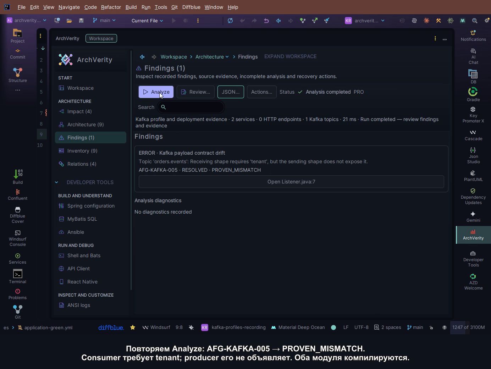

# Kafka между сервисами: profiles, доказанное расхождение и границы совместимости

Producer и consumer успешно компилируются. В обоих конфигурационных файлах стоит
`orders.events`, адрес bootstrap совпадает, Java-классы называются `Event`.
Из этого легко сделать слишком сильный вывод: сервисы обмениваются совместимыми
сообщениями. Для такого вывода ещё нужно установить scope кластера, выбранные
properties, цепочку serializer/deserializer и контракт получателя.

Здесь разбираем этот путь в **ArchVerity 3.0.4**: от двух независимых Kafka scopes
до обнаруженного обязательного поля `tenant`, исправления producer и повторной
проверки. В конце намеренно разделяем кластеры и возвращаем исходное состояние.
Это демонстрация установленного плагина в IntelliJ IDEA, с полными JSON exports
для каждой контрольной точки.

[](media/kafka-profiles-3.0.4.mp4)

**[Видео на 2 минуты 26 секунд с русскими пояснениями](media/kafka-profiles-3.0.4.mp4)** ·
[запись проверенных состояний](media/kafka-profiles-3.0.4.proof.json) ·
[полные native exports](evidence/kafka-3.0.4/README.md).
Видео смонтировано из записей настоящего окна IDEA; паузы подготовки сокращены.
Звуковой дорожки нет, объяснения находятся в титрах.

Сохранённую последовательность можно проверить без запуска IDEA и broker:

```powershell
python -B -X utf8 suite-support/inspect_kafka_story.py
```

Команда из корня репозитория проверяет шесть native exports, shapes, repository
identities, profile provenance, связи в пределах cluster scope и восстановление.
Она проверяет сохранённые результаты; для нового запуска анализ выполняет IDEA.

## Система, которую проверяем

В [kafka-profile-lab](../projects/kafka-profile-lab/README.md) два Gradle-модуля
представляют разные repository identities:

| Сторона | Repository в модели | Выбранный module profile | Контракт |
| --- | --- | --- | --- |
| producer | `demo/producer-repository` | `blue` | отправляет `Event` с обязательным `id` |
| consumer | `demo/consumer-repository` | `green` | ожидает обязательные `id` и `tenant` |

Глобальный `analysis.profiles` в `.archflow.yml` содержит `[default]`.
В `producer/.../application.yml` объявлен `spring.profiles.include: blue`,
в consumer — `green`. Поэтому property provenance в анализе ведёт к
`application-blue.yml` и `application-green.yml`. Название файла само по себе
не означает, что этот profile активен в реальном deployment.

Обе стороны разрешают `topics.orders → topic.alias → orders.events`.
В producer `spring.kafka.producer.value-serializer` сначала равен
`${KAFKA_VALUE_SERIALIZER}`. Значение внешнего ключа не известно анализу.
Consumer использует явный `JsonDeserializer<>(Event.class)` в своей фабрике.

Все данные и identities синтетические. Broker не запускаем: `127.0.0.1:1`
намеренно не является рабочим bootstrap. Видео подтверждает статический анализ,
навигацию к исходникам, exports и восстановление состояния.

## Повторить демонстрацию с нуля

Нужны Git, Python 3.10+, JDK 21 и совместимая IDEA с ArchVerity 3.0.4.
Analysis JSON export требует действующий Trial/Pro. Проект не выдаёт лицензию.
Версии fixture: Boot BOM 3.5.12, Spring Kafka 3.3.14, kafka-clients 3.9.2,
Jackson 2.19.4; версия broker не заявлена.

Из корня demo repository создайте новую самостоятельную копию:

```powershell
python -B -X utf8 suite-support/prepare_kafka_case.py --case unknown-cluster-and-override --output E:/CodexData/Temp/kafka-story
```

Helper создаёт собственный чистый Git HEAD и отказывается перезаписывать output.
Откройте `kafka-story` как Gradle project, выберите JDK 21, дождитесь импорта
producer и consumer и завершения индексации. Из созданной копии:

```powershell
./gradlew.bat :producer:classes :consumer:classes --console=plain
```

В Linux/macOS используйте `./gradlew`. Затем нажмите **ArchVerity → Analyze**.
Сохраняйте отдельный полный **JSON → Save analysis JSON** после каждого шага.
Используйте один и тот же проект и сбрасывайте текстовые фильтры перед сравнением.
Если меняете файлы внешним редактором или helper, выполните IDEA
**Reload All from Disk**, дождитесь синхронизации и только затем Analyze.
В [RUN_RECORD](RUN_RECORD.md) укажите IDE build, installed package identity,
путь копии и её HEAD. JSON checker отдельно не устанавливает identity окна IDEA.

## 1. Одинаковый topic, ещё неизвестный cluster scope

В **Architecture** видно два topic nodes с именем `orders.events`: отдельный
producer scope и отдельный consumer scope. В **Findings** присутствуют
`AFG-KAFKA-009/010` с disposition `UNKNOWN`. Неразрешённый внешний serializer
сохраняется в Evidence. Сообщения о ненайденной второй стороне остаются
наблюдениями в текущем scope.

Откройте topic или service в inspector: repository/module identity и source
paths объясняют, откуда взята связь. `RESOLVED` у имени topic означает, что имя
разрешено; это не доказательство общего физического Kafka кластера.

Сохраните `k01-unknown.json`. Из корня demo repository:

```powershell
python -B -X utf8 suite-support/inspect_kafka_export.py --case unknown-cluster-and-override --snapshot E:/CodexData/Temp/k01-unknown.json --project-id kafka-profile-lab
```

## 2. Объявляем общий scope, сохраняем UNKNOWN у wire

В корень `.archflow.yml` добавьте:

```yaml
kafka:
  defaultCluster: declared-demo
```

Это явная предпосылка статической модели. В настоящем проекте такое объявление
должно опираться на deployment information; оно не измеряет broker cluster ID.

Сохраните файл и повторите Analyze. В модели теперь один topic. Плагин видит
расхождение `tenant`, но `AFG-KAFKA-005` остаётся **UNKNOWN**;
`AFG-KAFKA-010` показывает отсутствующее независимое wire proof.
Цвет и severity не заменяют disposition.

Сохраните `k02-shared-unknown.json` и проверьте тем же checker с
`--case shared-cluster-unresolved-serializer`.

## 3. Устанавливаем точный статический JSON binding

В `producer/src/main/resources/application-blue.yml` замените внешний placeholder:

```yaml
spring:
  kafka:
    producer:
      value-serializer: org.springframework.kafka.support.serializer.JsonSerializer
```

Остальные поля YAML сохраните. В `producer/.../KafkaBindings.java` замените
непрозрачную для этого сценария factory map на точные constructor bindings:

```java
return new DefaultKafkaProducerFactory<>(
    Map.of(), new StringSerializer(), new JsonSerializer<>());
```

Повторите compile и Analyze. Теперь `AFG-KAFKA-005` имеет disposition
**PROVEN_MISMATCH**: получатель требует `tenant`, отправитель его не объявляет.
`009/010` исчезают. Обе стороны продолжают компилироваться.

Кнопка в finding открывает `consumer/.../Listener.java`. Перейдите к его
`demo.consumer.Event` и к `demo.producer.Event`: одинаковые короткие имена
классов скрывают разные shapes в двух repository identities.
Полный export сохраняет source evidence обеих сторон, profiles и factory chain.

Сохраните `k11-proven-drift.json`; checker: `--case proven-drift-control`.

## 4. Исправляем producer и проверяем результат

Consumer нужен `tenant`; добавьте его в отправляемую shape. В
`producer/src/main/java/demo/producer/Event.java`:

```java
public record Event(
    @JsonProperty(required = true) String id,
    @JsonProperty(required = true) String tenant
) {}
```

Сохраните, повторите compile и Analyze. В записанном прогоне **Findings (0)**:
статические shapes согласованы, scope и simple JSON bindings установлены.
Сохраните `k12-repaired.json`; checker: `--case compatible-static-control`.
В этой последовательности обе shapes содержат два поля; независимый recipe K12
достигает равенства удалением `tenant` у consumer. Оба варианта проверяют ту же
границу статического правила, но бизнес-решение об обязательности поля остаётся
за владельцем контракта.

## 5. Контроль ложной связи между кластерами

Верните producer DTO к исходному `id`, удалите `kafka.defaultCluster` из
`.archflow.yml`; точные JSON bindings сохраните. Добавьте в profile files:

```yaml
# producer application-blue.yml
archflow:
  kafka:
    cluster: east
```

```yaml
# consumer application-green.yml
archflow:
  kafka:
    cluster: west
```

Analyze снова показывает два topic scopes. Несмотря на одинаковое имя topic и
различающиеся DTO, `AFG-KAFKA-005/009/010` отсутствуют: между `east` и `west`
нельзя приписывать cross-cluster mismatch. Наблюдения о ненайденной второй
стороне в каждом scope допустимы. Сохраните `k03-separate.json`;
checker: `--case separate-clusters-same-topic`.

Для восстановления верните только свои изменения в пяти затронутых файлах:
`.archflow.yml`, оба profile YAML, producer `KafkaBindings.java` и `Event.java`.
Повторите Analyze. Сохраните `k01-recovery.json` и проверьте с case K01.
В записанном прогоне вернулись исходные topic identities, finding IDs и analysis
fingerprint; Git working tree подготовленной копии снова чистый.
Можно вместо ручного восстановления создать новый output из исходной лаборатории.

## Что доказано и где нужны дополнительные наблюдения

| Наблюдение | Допустимый вывод | Чего оно ещё не доказывает |
| --- | --- | --- |
| Compile обоих модулей | Java и выбранные библиотеки собираются | Сообщение прочитано другим сервисом |
| `blue/green` в source provenance | Анализ разрешил properties из этих module profiles | Effective deployment configuration |
| `kafka.defaultCluster` / `archflow.kafka.cluster` | Явно определён logical scope модели | Физический cluster ID, ACL и connectivity |
| `005 PROVEN_MISMATCH` | В установленной статической цепочке required shape расходится | Наблюдение реального отказа приложения |
| `Findings (0)` после исправления | Эти статические нарушения устранены | Успешная десериализация, доставка или бизнес-эффект |

Spring Kafka имеет настройки type headers, type mappings и trusted packages;
`JsonDeserializer<>(Event.class)` не отменяет необходимость проверить effective
настройки этих механизмов. Schema Registry проверяет другие артефакты и свою
compatibility policy; DTO scan не заменяет регистрацию схемы.
[Spring Kafka 3.3: serializers и headers](https://docs.spring.io/spring-kafka/reference/3.3/kafka/serdes.html),
[Confluent: проверка и исправление несовместимой схемы](https://docs.confluent.io/platform/current/schema-registry/schema_registry_onprem_tutorial.html#test-schema-compatibility).

Для реального deployment нужны его effective config и cluster ID, фактические
bytes/headers или schema ID, send acknowledgement, consumer processing и offset
commit. [Runtime evidence lab](../projects/runtime-evidence/README.md) отдельно
показывает identity-bound Actuator capture: `/beans` сообщает bean types и
dependencies, но не устанавливает effective wire format.

В [12 Kafka recipes](../projects/kafka-profile-lab/cases.json) есть соседние
контроли: regex topics, вложенный внешний ключ, fallback, цикл и analysis override.
Fallback у внешнего placeholder не считается доказательством deployed value.
Все эти cases имеют собственные expectations и checker; их coverage не следует
выводить из одного видео.

Для короткого знакомства остаётся [HTTP-разбор POST/PUT](FIRST_RESULT_ARTICLE_RU.md).
Для Git baseline и влияния изменений на архитектуру перейдите к
[workspace walkthrough](ARCHITECTURE_WALKTHROUGH_RU.md). Полный охват остальных
IDE/device/remote/licensing journeys отражён отдельно в
[функциональной проверке](FUNCTIONAL_AUDIT_RU.md).
